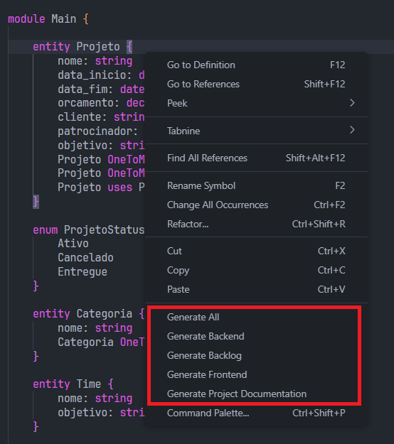

# First Steps

You can use Spark in both, or in VSCode with it pluggin (recommend), or it cli with NodeJs.

# Using in VSCode
## Pre-Requisits:
1. Installed VSCode (any version; dubh).

## Instalation
1. Open Visual Studio Code;
2. Click on Extensions;
3. Search for "Spark";
4. Click to install the Spark extension by LEDS IFES; and
5. Have Fun :)

## Features
1. An integrated gramma validation to .spark files; and
2. Simple access to Backend, Frontend and Project Documentation generation module.

## How to Use
1. Create a `.spark` file (e.g. `my_spark_file.spark`);
2. Fill it with your class, packages and specific some project configuration and save it;
3. Click with right mouse button (os api button 2); and
4. Select option you want (or generate all, or generate backend, or generate frontend or generate documentation).

# Using it CLI in Node
## Pre-Requisits
1. Have an good os (no, Windows is not a god os, use WSL instead);
2. NodeJs (recoomend 20.x or better) installed in your machine; and
3. NPM installed in your machine.

## Installation
1. On bash use the following comand: `npx install spark-leds-beta`.

## Features
1. Access only to all generation module mode.

## How to Use
1. On installed folder (where packages.json are) use the command `npx spark-cli generate path/to/.spark/file`.

## Output
1. A folder named "frontend" with the frontend generated;
2. A folder named "backend" with the backend generated; and
3. A folder named "docs" with the documentation files.

# Output Hierarchy Examples

